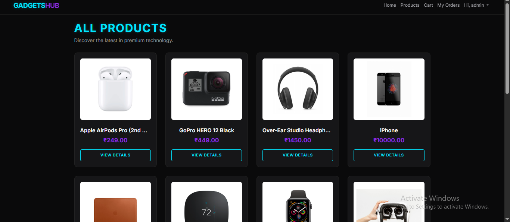
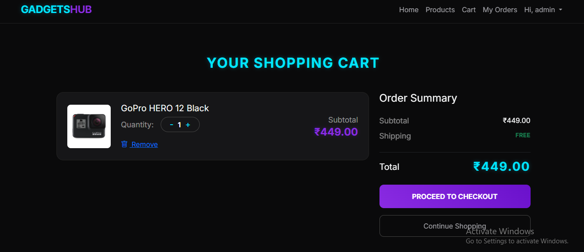
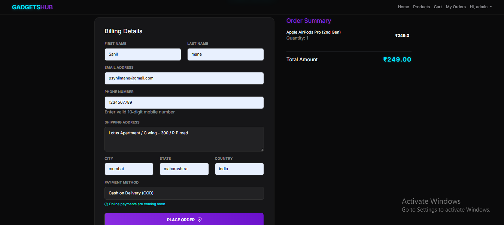
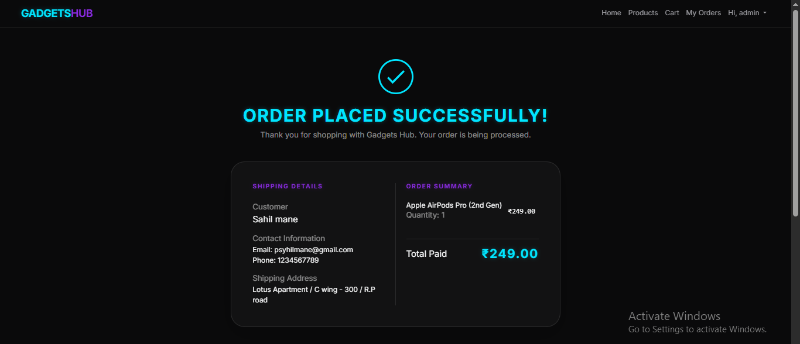
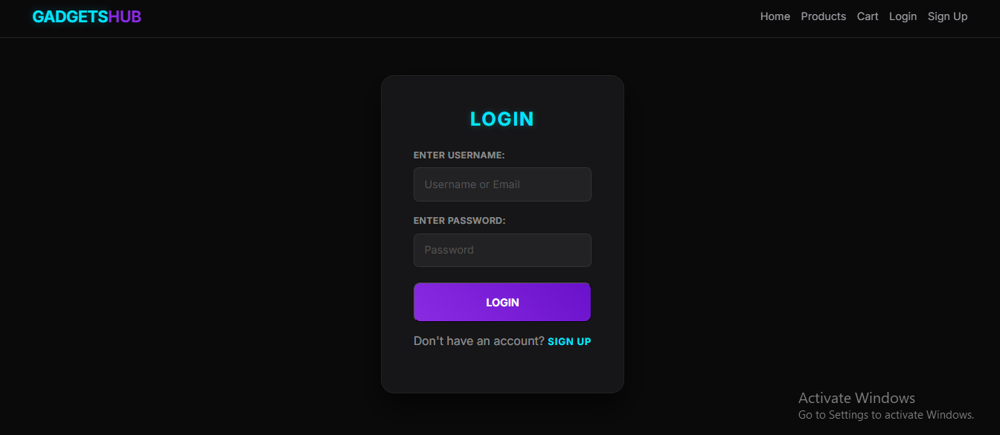

# 🛒 Gadgets Hub

**Gadgets Hub** is a full‑featured E‑commerce web application built using **Django**.  
It supports user authentication, session‑based cart, order management, and a modern responsive UI.

---

## 🚀 Features

- 🔐 User Authentication (Signup / Login / Logout)
- 🛍️ Session‑based Shopping Cart
- ➕ Add / Remove / Update Cart Items
- 📦 Order Placement & Order History (User‑specific)
- 🧑‍💼 Admin Panel for Product & Order Management
- 📊 Order Status Tracking (Pending, Shipped, Delivered, Cancelled)
- 💬 Django Messages with Auto‑Dismiss
- 📱 Fully Responsive UI (Desktop & Mobile)

---

## 🧰 Tech Stack

- **Backend:** Django (Python)
- **Frontend:** HTML, CSS, Bootstrap
- **Database:** SQLite (Development)
- **Authentication:** Django Auth System
- **Version Control:** Git & GitHub

---

## 📂 Project Structure

```text
Gadgets-Hub/
│
├── accounts/        # Signup, Login, Logout
├── products/        # Product listing & details
├── cart/            # Cart & session handling
├── orders/          # Orders & order history
├── templates/       # HTML templates
├── static/          # CSS, JS, images
├── db.sqlite3       # SQLite database (development)
├── manage.py
└── requirements.txt


## 🖼️ Screenshots

### 🏠 Home Page

--
(screenshots/home2.png)


### 🛍️ Products Page


### 🛒 Cart Page


### 💳 Checkout Page


### 📦 Order History


### 🧑‍💼 Login Page


### 📱 Signup Page

---

---

## 📌 Future Improvements

- 💳 Online payment integration (Razorpay / Stripe)
- ⭐ Product reviews & ratings
- ❤️ Wishlist feature
- 📧 Email notifications (Order confirmation & status updates)
- 🗄️ Production database migration (PostgreSQL)

---


---

## 👨‍💻 Author

**Sahil Mane**  
Django Developer | E‑commerce Project  

- 💻 Backend: Django  
- 🛒 Focus: E‑commerce Systems  
- 🚀 Passionate about building real‑world web apps

---

